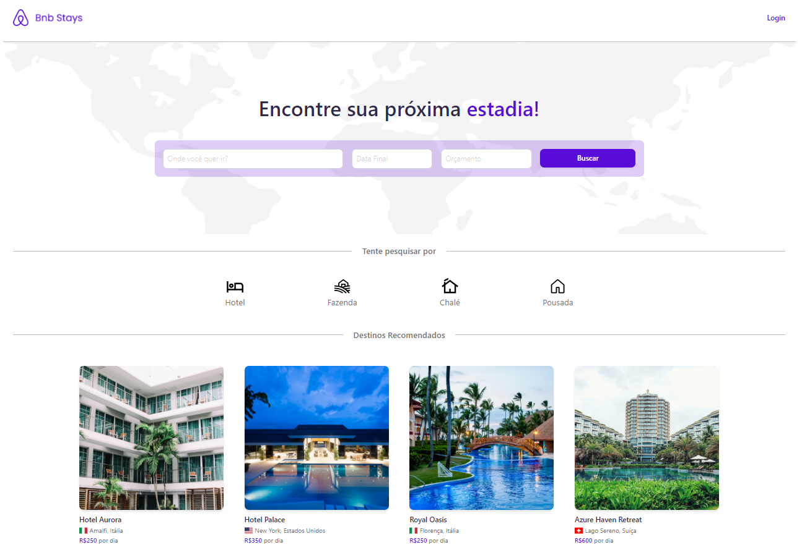
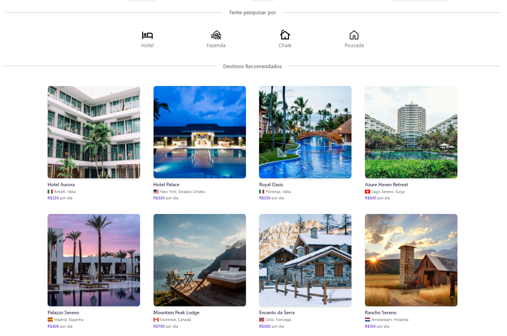
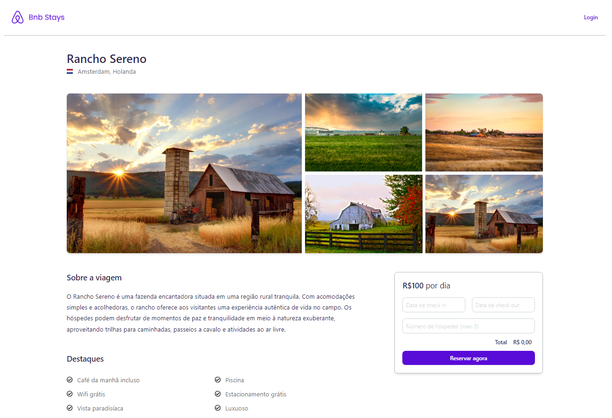
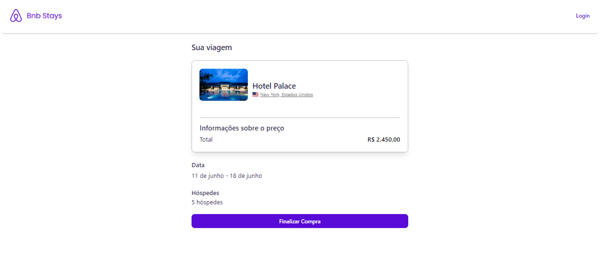
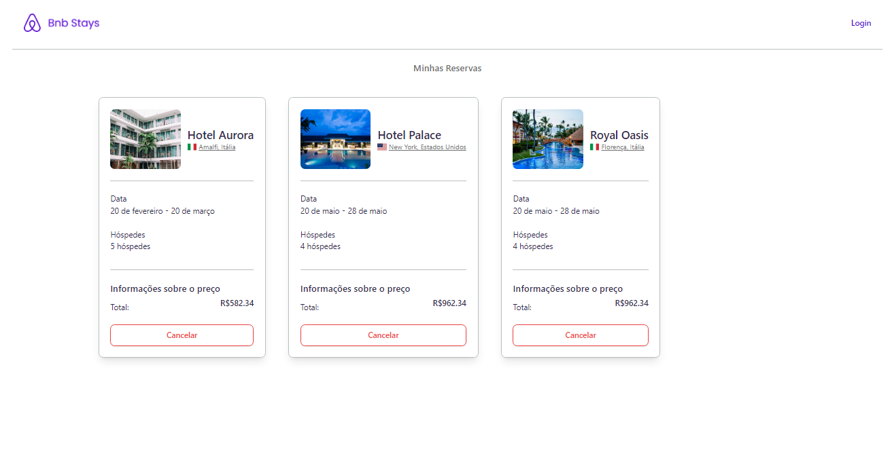

<h1 align="center">B&B Stays</h1>

<p align="center">
  <a href="#-tecnologias">Tecnologias</a>&nbsp;&nbsp;&nbsp;|&nbsp;&nbsp;&nbsp;
  <a href="#-projeto">Projeto</a>&nbsp;&nbsp;&nbsp;|&nbsp;&nbsp;&nbsp;
  <a href="#-layout">Layout</a>&nbsp;&nbsp;&nbsp;|&nbsp;&nbsp;&nbsp;
  <a href="#-licença">Licença</a>
</p>


<br>

<p align="center">
  
</p>

## 🚀 Tecnologias

 
 


 
 

     

## 💻 Projeto

**Uma aplicação front-end para reserva de estadias.** Oferece telas das funcionalidades de listagem de acomodações disponíveis, detalhes de cada acomodação, formulário de seleção de datas, tela de confirmação de reserva, acesso a usuário logado e visualização de reservas realizadas. Inicialmente o projeto foi desenvolvido em Next.js por por [Felipe Rocha](https://github.com/felipemotarocha). Meu desafio foi recriar a aplicação com uso do Vite no desenvolvimento sendo necessário implementação das rotas com React Router e requisições da aplicação para o backend que serão desenvolvidas futuramente.

## 🔖 Layout

Para a implementação das funcionalidades apresento algumas das páginas desenvolvidas:

### 1. Listagem de acomodações disponíveis
Permite visualizar todas as acomodações.
<p align="center">
  
</p>

### 2. Detalhes de acomodação
Permite visualizar detalhes da acomodação selecionada e realizar a seleção de datas disponíveis para reserva.
<p align="center">
  
</p>

### 3. Confirmação de reserva
Exibe os dados da consulta realizada para a confirmação da reserva.
<p align="center">
  
</p>

### 4. Reservas realizadas
Exibe todas as reservas realizadas pelo usuário.
<p align="center">
  
</p>

## 🏃 Iniciando o Projeto
Primeiro clone este repositório remoto em sua máquina local:

[https://github.com/denisonkolling/bnb-react.git](https://github.com/denisonkolling/bnb-react.git)

Lembre-se de adicionar as dependências do projeto:

```bash
npm install
# ou
yarn install
```

Inicie o servidor de desenvolvimento:
```bash
npm run dev
# ou
yarn run dev
```

Acesse [http://localhost:5173/](http://localhost:5173/) com seu navegador para acessar a aplicação.

## 💹 Melhorias em Desenvolvimento

Cronograma de melhorias e desenvolvimento de novas funcionalidades da aplicação:

⏳ - Criar página com formulário de cadastro de usuário.<br/>
🧱 - Melhorar a responsividade para dispositivos móveis.<br/>
🌍 - Criar mapa dinâmico para exibição da localização da acomodação.<br/>
💽 - Criar requisições para aplicação backend.<br/>

## 📝 Licença

Este projeto está sob a licença MIT.

---